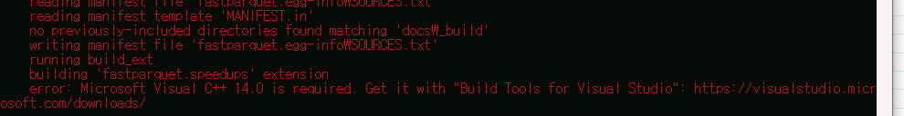

처음에 `pandas` 로 데이터를 저장하기 위해 사용했던 것은 csv 였으나, 단점이 2가지가 있었다 
1. 너무 큰 사이즈로 저장되어 불러오고 저장할 때 다소 시간이 소요됨
2. dtype이 저장되지 않음

그러다 pickle, parquet feather 등의 파일 포맷을 알게되었고, 처음에 pickle을 사용해 저장해서 
속도에 꽤 만족했으나, 2억개의 셀 이상은 저장하지 못한다는 한계가 보여 parquet을 선택했다.

### 필요한 python libraries
parquet을 사용하기 위해선 아래 `fastparquet` 과 `pyarrow` 가 설치되어 있어야 한다. 

pip 를 이용해서 설치해주자.

```
pip install fastparquet
pip install pyarrow
```

:warning: 설치하다보면 C++ Build Tool 14 이상이 설치되어 있어야 한다고 한다.


  

빌드 툴을 설치하는 방법은 아래 블로그를 참고했다. 

https://dololak.tistory.com/520


### parquet 저장
dataframe 을 parquet으로 저장하는 코드는 아래와 같다.

`데이터프레임.to_parquet('저장경로',compression='zip종류')`


```python
df.to_parquet('data.parquet.gzip',compression='gzip')
```


### parquet 불러오기
parquet 파일을 불러오는 코드는 아래와 같다. 
`read_parquet('저장경로의 파일')`

```python
df = pd.read_parquet('data.parquet.gzip')
```
